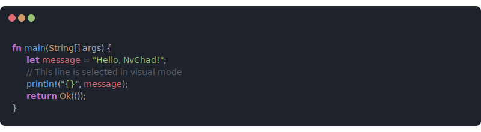

# CodeSvg



## Introduction

CodeSvg is a simple Go-based microservice that transforms source code into beautiful, syntax-highlighted SVG images. 
Inspired by the aesthetics of modern code editors like NvChad, it features:

### Setup

To run the server locally, you only need to have Go installed.

```bash
# Clone the repository
git clone https://github.com/micartey/code-svg.git

# Navigate into the directory
cd code-svg

# Run the server using just
just run
```

### Build from source

If you prefer to build the binary yourself:

```bash
go build -o server .
./server
```

The server will start on `:8080` by default.

## Usage

The primary endpoint is `/svg`. You can provide the code either as a query parameter or in the request body.

### Query Parameters

| Parameter | Type   | Description                                      |
|-----------|--------|--------------------------------------------------|
| `code`    | string | Base64 encoded source code to be rendered. |

```bash
curl "http://localhost:8080/svg?code=Zm4gbWFpbigpIHsKICAgIHByaW50bG4hKCJIZWxsbyIpOwp9"
```

### Request Body

Alternatively, you can send the base64 encoded code directly in the request body.

```bash
cat <file> | base64 | curl -d @- http://localhost:8080/svg
```

