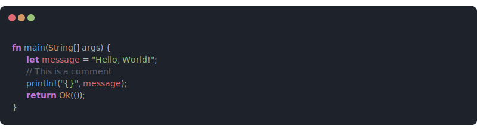

# code2svg



## 📚 Introduction

code2svg is a simple Go-based microservice that transforms source code into beautiful, syntax-highlighted SVG images. 
These svg images use normal text and thus can be copied!
However, GitHub e.g. does not support the direct import of svgs and therefore this feature is not working in Readme files... 
They can only be included as normal images.

### Example

The following link will return an svg with a simple hello world example:

```
https://code.micartey.dev/svg?code=ZnVuYyBoZWxsbygpIHsKICAgIGZtdC5QcmVudGxuKCJIZWxsbyIpCn0=
```

Taking this link in wrapping it inside a markdown image tag will result in the following image:


### Setup

To run the server locally, you only need to have Go installed.

```bash
# Run the server using just
just run

# Or build from source
go build -o server .
./server
```

The port is `8080` unless an environment variable is provided.

#### Nix/NixOS

If you are using Nix, you can run the server directly:

```bash
nix run github:micartey/code2svg
```

To host it on a NixOS server, add the flake to your inputs and import the module:

```nix
{
  inputs.code2svg.url = "github:micartey/code2svg";

  outputs = { self, nixpkgs, code2svg }: {
    nixosConfigurations.my-server = nixpkgs.lib.nixosSystem {
      system = "x86_64-linux";
      modules = [
        code2svg.nixosModules.default
        {
          services.code2svg = {
            enable = true;
            port = 8080;
            openFirewall = true;
          };
        }
      ];
    };
  };
}
```

## 🚀 Usage

The primary endpoints are `/svg` and `/png`. You can provide the code either as a query parameter or in the request body.

- `/svg`: Returns an SVG image (`image/svg+xml`).
- `/png`: Returns a PNG image (`image/png`). This is converted on-the-fly from the SVG using `rsvg-convert`.

### Query Parameters

| Parameter     | Type    | Description                                      |
|---------------|---------|--------------------------------------------------|
| `code`        | string  | Base64 encoded source code to be rendered.       |
| `transparent` | boolean | Set to `true` to remove the background color.   |


```bash
curl "http://localhost:8080/svg?code=Zm4gbWFpbigpIHsKICAgIHByaW50bG4hKCJIZWxsbyIpOwp9"
```

### Request Body

Alternatively, you can send the base64 encoded code directly in the request body.

```bash
cat <file> | base64 | curl -d @- http://localhost:8080/svg
```

